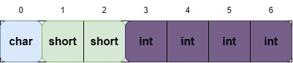
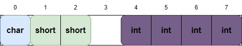
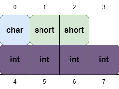
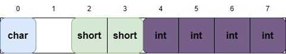
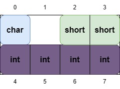
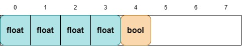
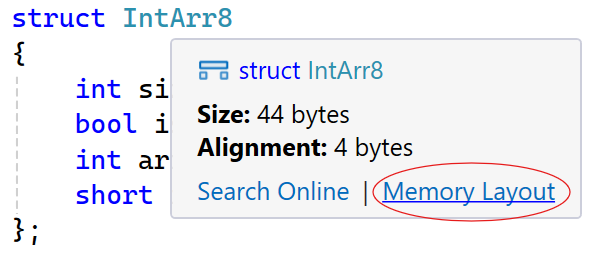
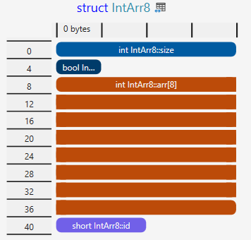

# Създаване на обекти при структурата
Позволено е и да създаваме обекти директно след като напишем структурата. Тези обекти ще са глобални, ако структурата е написана на глобално ниво.

```cpp
struct Point
{
    double x, y;
} point; // създаваме обект

void reset()
{
    point = {0, 0};
}

void move(double x, double y)
{
    point.x += x;
    point.y += y;
}

int main()
{
    reset();
    move(5, 10);

    std::cout << point.x << " " << point.y; // 5 10
}
```

# Подаване на обекти като параметър
Спомняме си, че когато подаваме променливи като параметри, те се подават по копие. Това означава, че ако приложим някаква промяна върху този параметър, тя няма да се отрази върху реалната подадена променлива. Това важи и при структурите, но се оказва, че може да доведе до проблеми с производителността на програмата ни. Нека си представим следната ситуация:

```cpp
struct Color
{
    int r, g, b;
}

struct Image
{
    enum class Type
    {
        PNG,
        JPEG,
        GIF
    } Type; // както при структурите, така и при enum-ите можем да създаваме инстанции директно след дефиницията
    Color canvas[1024][1024];
}

Image loadFromFile(const char* fileName)
{
    // more on that next time ;)
}

Image createInverse(Image image)
{
    // implementation
}

Image createMonochrome(Image image)
{
    // implementation
}

int main()
{
    Image image = loadFromFile("image.png");

    Image edited = createInverse(image);
    edited = createMonochrome(edited);
}
```

Забелязваме, че всеки път когато подадем `Image` като параметър, той ще се копира, а размерът му хич не е малък (`12.6 MB`). Ако сме в по-комплексна ситуация, където тези функции се викат в цикъл, можем да си представим колко много ще затлачим работата на програмата.  

На практика винаги когато подаваме структура като параметър, я подаваме под формата на *референция*. Размерът на референцията == Размерът на указателя, т.к. са едно и също нещо. Както помним, размерът на указателя е или 4 или 8 байта, което е много по-добре от 12.6 MB. И т.к. не възнамеряваме да променяме стойностите на самия обект, го подаваме по *константна референция*.  

```cpp
Image createInverse(const Image& image)
{
    // implementation
}

Image createMonochrome(const Image& image)
{
    // implementation
}
```

Успешно избегнахме копирането на `image`, защото сега само подаваме референция към самия обект а не негово копие, което е в пъти по-лека операция.

# #pragma once
Когато `#include`-ваме някой файл, нямаме гаранция че програмистът няма да го включи отново неволно. Представяме си следната ситуация:

**Color.h**
```cpp
struct Color
{
    int r, g, b;
};
```

**SomeFunctions.h**
```cpp
#include "Color.h"

int colorSum(const Color& color)
{
    return color.r + color.g + color.b;    
}
```

**OtherFunctions.h**
```cpp
#include "Color.h"

int colorProduct(const Color& color)
{
    return color.r * color.g * color.b;
}
```

**main.cpp**
```cpp
#include <iostream>
#include "SomeFunctions.h"
#include "OtherFunctions.h"

int main()
{
    Color col {1, 2, 3};
    std::cout << colorSum(col) << " " << colorProduct(col);
}
```

Получаваме следната грешка: `'Color': 'struct' type redefinition`  
Причината за това е че когато се разгънат всичките `#include`-ове, те придобиват следния вид:

**main.cpp**
```cpp	
// [...] игнорираме <iostream>

struct Color
{
    int r, g, b;
};

int colorSum(const Color& color)
{
    return color.r + color.g + color.b;    
}

struct Color // проблемът идва от тук
{
    int r, g, b;
};

int colorProduct(const Color& color)
{
    return color.r * color.g * color.b;
}

int main()
{
    Color col {1, 2, 3};
    std::cout << colorSum(col) << " " << colorProduct(col);
}
```

Най-разпространения начин за справяне с този проблем е `#pragma once`. Когато поставим `#pragma once` в началото на някой файл, казваме на компилатора, че не искаме този файл да се разгъва втори път. Т.е. ако си напишем header-a по следния начин:

**Color.h**
```cpp
#pragma once

struct Color
{
    int r, g, b;
};
```

Тогава няма да имаме проблем, защото след като се разгънат всички `#include`-ове, те ще добият следния вид:

```cpp	
// [...] игнорираме <iostream>

struct Color // първото и единствено включване на Color.h
{
    int r, g, b;
};

int colorSum(const Color& color)
{
    return color.r + color.g + color.b;    
}

int colorProduct(const Color& color)
{
    return color.r * color.g * color.b;
}

int main()
{
    Color col {1, 2, 3};
    std::cout << colorSum(col) << " " << colorProduct(col);
}
```

Практически винаги в началото на всеки `header` (`.h`) файл трябва да слагаме `#pragma once`. Visual Studio го прави автоматично.

# Структури на локално ниво
Структурите могат да се пишат и локално за някоя функция:

```cpp
int foo()
{
    struct Color 
    {
        int r, g, b;
    } color {255, 255, 255};

    color.r = color.g / 2;
    color.b = color.r / 2;

    return color.r + color.g + color.b;
}

int main()
{
    struct Data
    {
        int size;
        int sum;
        char prefix;
    };

    Data d {20, foo(), 'G'};

    Color color; // ERROR, identifier "Color" is undefined
}
```

# Анонимни структури
Ако искаме да създадем само 1 или малко обекти от структура, която няма да бъде преизползвана, понякога е по-добре тя да бъде анонимна, т.е. да няма име:

```cpp
int main()
{
    struct
    {
        int value;
        float precision;
    } data;

    data.value = 152;
    data.precision = 0.3;
}
```

По този начин след дефинирането на структурата няма* да можем да създаваме други обекти от такъв тип.

Технически е възможно, за любопитния студент - [decltype](https://en.cppreference.com/w/cpp/language/decltype)

# Alignment & Padding

## Подравняване

В паметта полетата на една струкура са разположени в същия ред в който те са декларирани. Това означава, че ако имаме четири полета със следните типове `int`, `char`, `bool`, `double`, в паметта първо ще стои променливата с тип `int`, след това `char`, `bool` и накрая `double`.  

Паметта която заема една структура се определя от подредбата на полетата и зададеното *подравняване(alignment)* на структурата. Спрямо тези два фактора може да се появи т.нар. *padding*, който може да доведе до някои изненади с размера на структурата.

Нека започнем с един прост пример. Имаме следната структура:

```cpp
struct Shipment
{
    char initial;    // 1 byte
    short prefixNum; // 2 bytes
    int shipmentNum; // 4 bytes
}
```

Интуитивно бихме очаквали размера на структурата да е `7 байта`. Но това не е така. Реално е `8 байта`. Какво се случва?

Както казахме, полетата в паметта на една структура са разположени в реда на тяхното деклариране. Следователно очакваме паметта да е разположена по следния начин: 



## Padding and memory reading

Но това не е така. Вярно е, че полетата са разположени в реда на декларирането, но въпреки това е възможно да се получи т.нар `padding`. Т.к. структурите "пакетират" променливи с различни типове (следователно различни размери) е нужно структурата да се оптимизира за да може да бъде прочетена оптимално от компютъра. 

По-правилна подредба в паметта би била следната:



Въпреки, че вече заетата памет е правилна, все още има неточност, която ще се доизясни след малко.  

Празното пространство на индекс 3 се нарича `padding`. То е поставено за да може структурата да се "подчини" на т.нар. `alignment` и да улесни процесора при четене и достъпване до елементите на една структура. Размера на една структура трябва да може да се дели на размера на най-големия примитивен тип, който се съдържа в нея.

## Memory Alignment

`Alignment`-а се определя от размера на **най-големия** примитивен тип, който се съдържа в нея. Ако си представим разпределението на паметта на една структура като матрица, то `alignment`-a определя броя на колоните в нея, а полетата се опитват да се съберат в редовете.



*Важно: всяко поле трябва да бъде на позиция(адрес), който се дели на неговия `alignment`. В случая това важни за всички прости типове и те имат `alignment` равен на техния размер.*  
  
Следователно `alignment`-а на една структура е равен на `alignment`-а на най-големия примитивен тип в нея. Когато имаме вложени елементи в една структура(тоест обекти от друга структура) се проверяват рекурсивно всички нейни полета до достигане на елемент с примитивен тип.

Вече знаем и какво е `alignment`. Следователно на горната графика няма как `short` да започва от позиция `1`, т.к. `alignment`-а на `short` е `2`. `short` може да започва само от позиция кратна на `2` - `0, 2, 4, 6, ...`. Следователно правилното разпределение ще е следното:





`Padding` можем да имаме както между две(или повече полета), така и в края на структурата. Ако вземем за пример следната структура:

```cpp
struct BankBalance
{
    float balance;
    bool isActive;
};
```

То нейното разположение в паметта ще изглежда по следния начин:



### Празна структура

Празната структура е със `size` и `alignment` `1 byte`

### Visual Studio 2022 17.8

От Visual Studio 2022, версия 17.8 вече може да се визуализира представянето на паметта на структурите директно в `IDE`-то.  
За да отворим графиката е нужно просто да сложим мишката върху името на структурата и да изберем *Memory Layout*. Освен това ще забележим и че Visual Studio ни помага като ни каже размера и подравняването на структурата.





# Битови полета

Битовите полета са начин да спестим място в една структура. Нека вземем за пример следната такава:

```cpp
struct Flags
{
    bool isAvailable;			// 1 byte
    bool isAdmin;				// 1 byte
    unsigned char errorCode;	// 1 byte, като ще използваме само стойностите от 0-15
};
```

Тази структура заема `3 байта` пространство. Като се замислим, `bool` заема цял байт, въпреки че съдържа 1 бит информация - 0 или 1. В С++ типовете са най-малко 1 байт, за това `bool` всъщност заема цял байт.

Когато сме в структура, обаче, можем да изкривим тези правила малко с т.нар. Битови полета (`Bit-fields`). Можем да "лимитираме" колко пространство заема всяко едно поле по следния начин:

```cpp
struct Flags
{
    bool isAvailable : 1;			// 1 bit
    bool isAdmin : 1;				// 1 bit
    unsigned char errorCode : 4;	// 4 bits
};
```

Сега всяко поле може да ползва толкова бита, колкото са зададени след `:`. По този начин, двата bool-а и char-a могат да се поберат на едно място, използвайки общо 6 бита. Самата структура ще е с размер 1 байт въпреки всичко. 

```cpp
Flags flag {true, false, 12};
```

---
Битовите полета са приложими ако наистина трябва да използваме минимално пространство, често при вградени системи.

Типовете, които можем да ползваме като битови полета са само целочислените - int, unsigned int, bool, char.

Битовите полета **не** са портативни, т.е. някои части от тях (например подравнение) са зависими от имплементацията, и резултатът на един компилатор може да е различен от резултата на друг.
